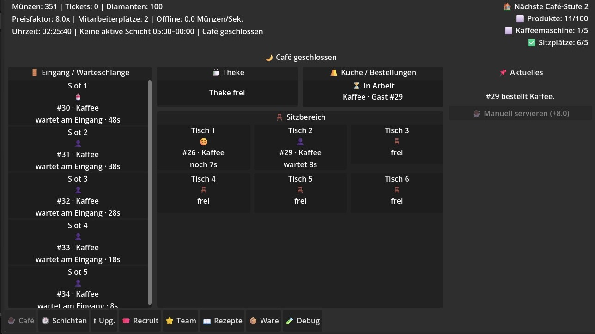
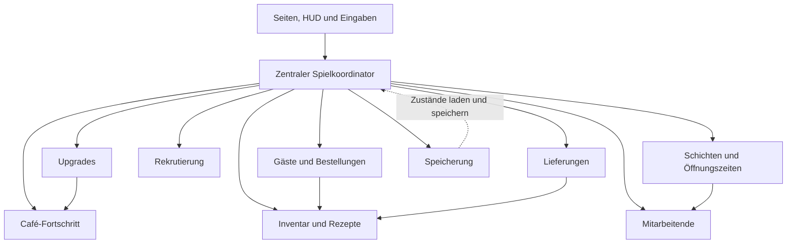
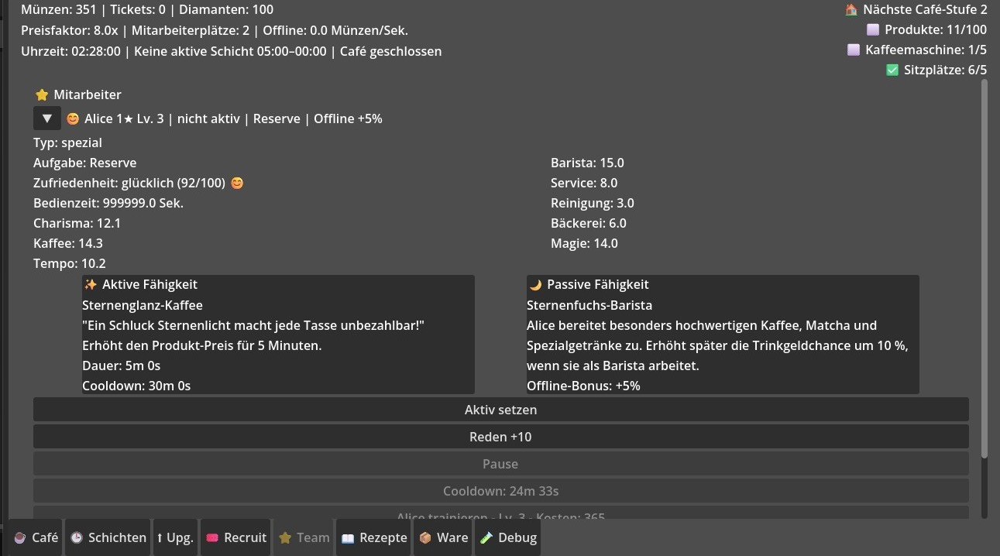
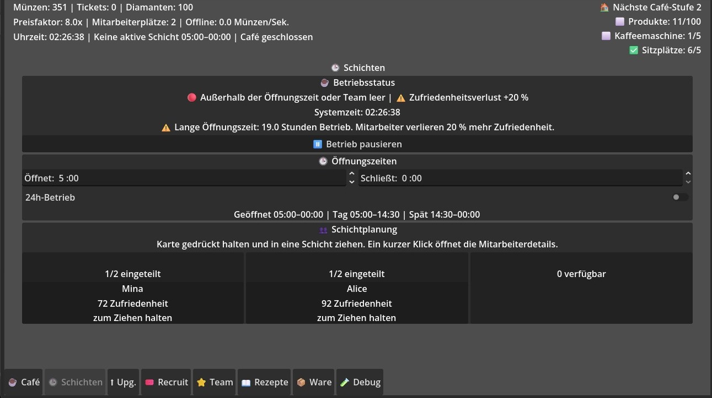
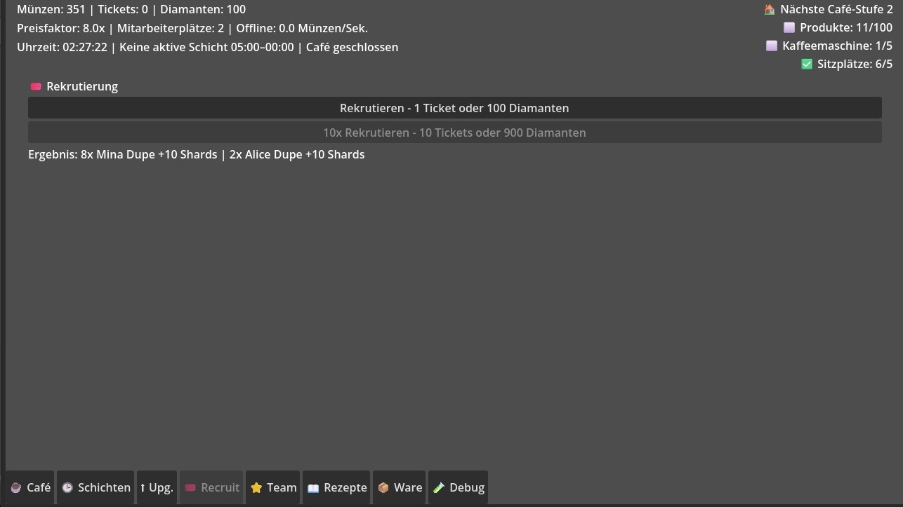
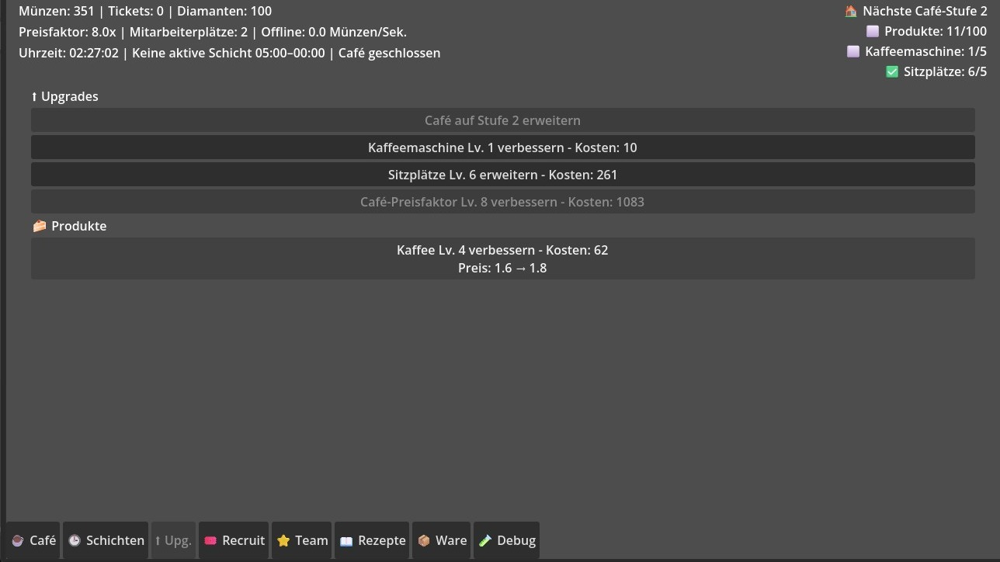
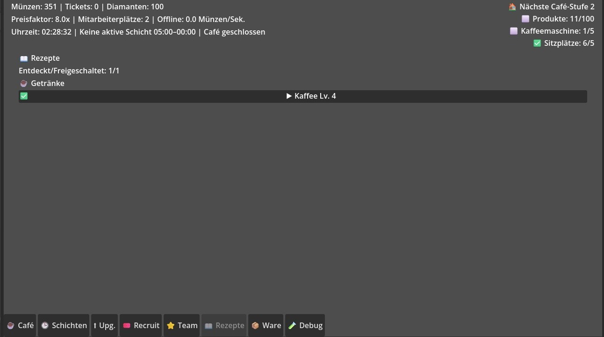
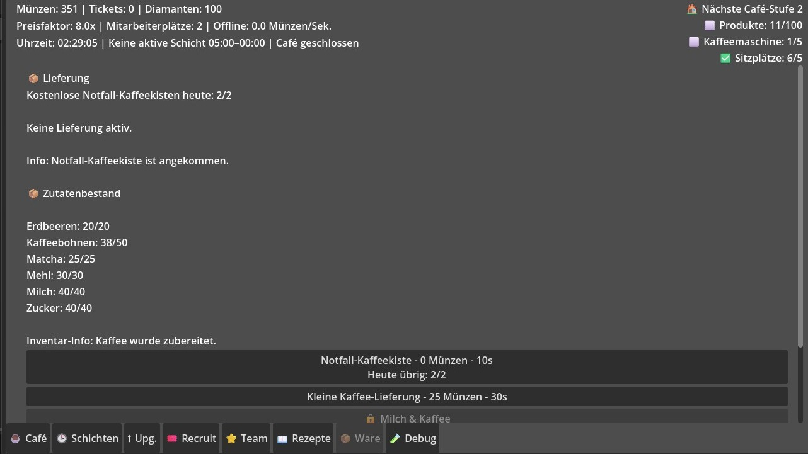

# Midnight Spirit Café


**Midnight Spirit Café** ist ein von mir entwickelter Idle-Management-Prototyp in Godot.  
Spielende betreiben ein nächtliches Café, verwalten Gäste, Bestellungen, Zutaten, Mitarbeitende, Schichten, Rekrutierungen, Upgrades und zeitbasierten Fortschritt.

> Dieses öffentliche Repository ist eine bewusst reduzierte Portfolio-Dokumentation.  
> Das vollständige Godot-Projekt und die zentrale Spiellogik befinden sich in einem privaten Entwicklungs-Repository.

<p align="center">
  
</p>

## Projekt in 30 Sekunden

| Bereich | Stand |
|---|---|
| Engine | Godot 4.7 |
| Sprache | GDScript |
| Genre | Idle Game / Café Management |
| Status | Spielbarer Prototyp, aktiv in Entwicklung |
| Meine Aufgaben | Konzeption, Architektur, Implementierung, UI-Prototyping, Debugging und Dokumentation |
| Schwerpunkt | Zusammenspiel mehrerer persistenter und zeitbasierter Spielsysteme |

Der Prototyp simuliert einen vollständigen Café-Ablauf:

```text
Gast erscheint
→ Warteschlange
→ Bestellung
→ Zutatenprüfung
→ Zubereitung
→ Bedienung am Tresen oder Tisch
→ Bezahlung
→ Fortschritt und Upgrades
```

## Umgesetzte Systeme

### Café-Simulation

- Warteschlange, Tresen und Sitzplätze
- Gäste mit Wartezeit und Geduld
- Bestellaufnahme, Zubereitung, Servieren und Bezahlung
- Behandlung fehlender Zutaten
- Café-Stufen und Freischaltbedingungen

### Inventar, Rezepte und Lieferungen

- Zutaten mit individuellen Lagergrenzen
- Rezepte mit Zutatenbedarf, Preis und Zubereitungszeit
- Freischaltungen über Café-, Maschinen- und Ofenfortschritt
- zeitbasierte Lieferungen und begrenzte Notfalllieferungen

### Mitarbeitende und Schichten

- Mitarbeitende mit Werten, Rollen und Fähigkeiten
- Zufriedenheit, Pausen und Gespräche
- aktive und passive Effekte
- Tag- und Spätschichten
- Drag-and-drop-Zuweisung
- optionale 24-Stunden-Öffnung

### Rekrutierung und Fortschritt

- Rekrutierung mit unterschiedlichen Währungen
- Einzel- und Mehrfachrekrutierung
- Verarbeitung doppelter Figuren über Fortschrittsressourcen
- Training, Level und Sternstufen
- Upgrades für Maschinen, Sitzplätze und Produktwert

### Speicherung und Idle-Fortschritt

- lokaler Spielstand über Godots `user://`-Verzeichnis
- getrennte Zustände der fachlichen Manager
- defensive Wiederherstellung gespeicherter Dictionaries
- Zeitstempel für Offline-Fortschritt
- begrenzte Offline-Berechnung

## Architektur

Der Prototyp verwendet einen zentralen Koordinator und mehrere fachlich getrennte Manager. Dadurch sind Inventar, Gäste, Mitarbeitende, Schichten, Upgrades und Speicherung als eigenständige Verantwortungsbereiche modelliert.



Eine ausführlichere Einordnung steht in [docs/ARCHITEKTUR.md](docs/ARCHITEKTUR.md).

## Technische Herausforderungen

- mehrere voneinander abhängige Systeme konsistent halten
- zeitbasierte Abläufe während und außerhalb der aktiven Spielsitzung berechnen
- gespeicherte Daten robust und mit sicheren Standardwerten laden
- dynamische UI-Inhalte mit veränderlichen Spielzuständen synchronisieren
- Öffnungszeiten, Schichten und Mitarbeiterboni gemeinsam auswerten
- den gewachsenen Prototyp ohne Funktionsverlust schrittweise refaktorieren

## Bewusster Umgang mit technischem Schuldenstand

Der erste spielbare Stand wurde schnell zu einem systemreichen Prototyp. Dadurch wurde der zentrale Koordinator im Laufe der Entwicklung zu groß und die UI wird an einigen Stellen noch stärker zur Laufzeit erzeugt als langfristig sinnvoll.

Die laufende Überarbeitung erfolgt deshalb in überprüfbaren Schritten:

1. Projekt- und Cache-Altlasten bereinigen
2. Szenenbaum und Node-Namen vereinheitlichen
3. Verantwortlichkeiten aus dem zentralen Koordinator auslagern
4. UI-Aktualisierung von vollständigen Frame-Updates auf Signale und Dirty-Flags umstellen
5. die aktuelle Drei-Spalten-Ansicht durch eine zusammenhängende Café-Raumansicht ersetzen

Diese Entscheidung und der aktuelle Stand sind in [docs/ROADMAP.md](docs/ROADMAP.md) dokumentiert.

## Ausgewählter Code-Einblick

Unter [code_samples/cafe_progression_example.gd](code_samples/cafe_progression_example.gd) liegt ein kleiner, generalisierter GDScript-Auszug. Er zeigt:

- typisierte Funktionssignaturen
- Validierung vor Zustandsänderungen
- Signal-basierte Benachrichtigung
- defensive Serialisierung und Deserialisierung

Der Auszug enthält bewusst keine Produktionswerte, vollständigen Manager oder direkt übernehmbare Kernlogik.

## Weitere Ansichten

<table>
  <tr>
    <td width="50%"></td>
    <td width="50%"></td>
  </tr>
  <tr>
    <td align="center"><strong>Mitarbeitersystem</strong></td>
    <td align="center"><strong>Schichtplanung</strong></td>
  </tr>
  <tr>
    <td></td>
    <td></td>
  </tr>
  <tr>
    <td align="center"><strong>Rekrutierung</strong></td>
    <td align="center"><strong>Upgrades</strong></td>
  </tr>
  <tr>
    <td></td>
    <td></td>
  </tr>
  <tr>
    <td align="center"><strong>Rezepte</strong></td>
    <td align="center"><strong>Lieferungen und Inventar</strong></td>
  </tr>
</table>

## Qualitätssicherung

Der aktuelle Prototyp wird nach strukturellen Änderungen über einen wiederholbaren manuellen Smoke-Test geprüft. Dazu gehören unter anderem:

- Projektstart und Seitennavigation
- Café-Ablauf und Bestellungen
- Rekrutierung mit beiden Währungen
- Upgrades und korrekter Ressourcenabzug
- Lieferungen und Rezeptfreischaltungen
- Schichten und Öffnungszeiten
- Speichern, Neustart und Laden

Das öffentliche Repository besitzt zusätzlich einen automatischen Schutzcheck. Er verhindert, dass versehentlich vollständige Godot-Szenen, Produktionsskripte oder `project.godot` veröffentlicht werden.

Details: [docs/QUALITAETSSICHERUNG.md](docs/QUALITAETSSICHERUNG.md)

## Warum der vollständige Quellcode nicht öffentlich ist

Dieses Repository soll Arbeitgebern meine Arbeitsweise, Systemarchitektur, technische Entscheidungen und den sichtbaren Entwicklungsstand zeigen. Es ist kein Open-Source-Release.

Nicht enthalten sind insbesondere:

- das startbare Godot-Projekt
- Produktionsszenen und Ressourcen
- vollständige Manager und der zentrale Koordinator
- Speicher- und Offline-Logik
- konkrete Balancingwerte und Inhaltsdaten
- interne Debug-Werkzeuge

Ein geführter Code-Walkthrough des privaten Projekts kann im Rahmen eines Bewerbungsprozesses erfolgen.

## Dokumentation

- [Architektur](docs/ARCHITEKTUR.md)
- [Technische Entscheidungen](docs/TECHNISCHE_ENTSCHEIDUNGEN.md)
- [Qualitätssicherung](docs/QUALITAETSSICHERUNG.md)
- [Roadmap und Refactoring](docs/ROADMAP.md)
- [English project summary](README_EN.md)

## Autor

**Justin Plath**  
Softwareentwicklung mit Schwerpunkt auf systemorientierten Anwendungen, Zustandsverwaltung und pragmatischer Problemlösung.

Kontakt über mein GitHub-Profil.

## Rechte

Dieses Repository gewährt keine Open-Source-Lizenz. Inhalte dürfen betrachtet und im Rahmen einer Portfolio-Bewertung verlinkt werden. Weitere Nutzung, Vervielfältigung oder Weitergabe ist nicht gestattet.

Siehe [NOTICE.md](NOTICE.md).
