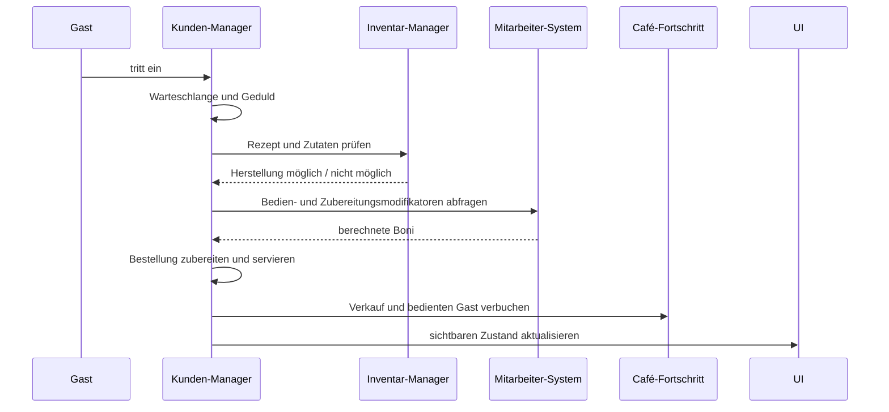
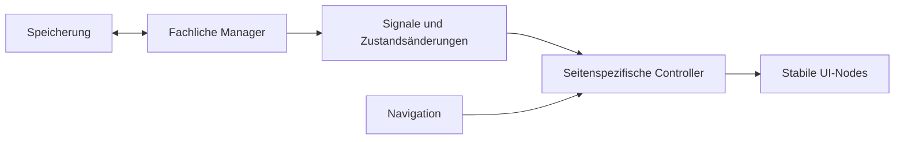

# Architektur

## Ziel der Struktur

Der Prototyp verbindet mehrere Systeme, die gleichzeitig auf denselben Spielzustand wirken. Die Architektur trennt fachliche Verantwortung deshalb in spezialisierte Manager, während ein zentraler Koordinator den Ablauf und die UI-Verbindungen zusammenführt.

## Schichten

### 1. Präsentation

Die Präsentationsschicht umfasst:

- Café-Seite
- Upgrade-Seite
- Rekrutierung
- Mitarbeiteransicht
- Rezepte
- Lieferung
- Schichtplanung
- Top- und Bottom-HUD

Die Seiten liegen in getrennten Overlay- und HUD-Ebenen. Dadurch bleiben Header und Navigation sichtbar, während die Inhaltsseite gewechselt wird.

### 2. Koordination

Der zentrale Spielkoordinator:

- erzeugt und verbindet die Manager
- leitet Benutzereingaben weiter
- synchronisiert globale Anzeigen
- koordiniert Speichern und Laden
- verbindet zeitbasierte Simulation mit der Darstellung

Der Koordinator ist im Prototyp zu stark gewachsen. Seine schrittweise Aufteilung ist daher ein aktiver Refactoring-Punkt.

### 3. Fachliche Manager

| Bereich | Verantwortung |
|---|---|
| Café-Fortschritt | Café-Stufe, Fortschrittswerte und Freischaltungen |
| Gäste | Warteschlange, Bestellungen, Geduld, Plätze und Bezahlung |
| Inventar | Zutaten, Lagergrenzen, Rezepte und Herstellung |
| Mitarbeitende | Werte, Level, Fähigkeiten, Zufriedenheit und Aufgaben |
| Schichten | Öffnungszeiten, Teams und aktive Schicht |
| Rekrutierung | Ziehungen, Währungen und Duplikatverarbeitung |
| Upgrades | Maschinen, Sitzplätze und Produktwert |
| Lieferungen | Lieferoptionen, Timer und Wareneingang |
| Bäckerei | Freischaltung und Ofenfortschritt |
| Speicherung | lokale Datei, sichere Typprüfung und Zeitstempel |
| Texte | deutsche und englische UI-Texte |
| Debugging | Testaktionen für Entwicklungszustände |

## Beispielhafter Datenfluss einer Bestellung

## Persistenz

Jeder fachliche Bereich exportiert seinen eigenen Zustand als Dictionary. Beim Laden werden Werte defensiv geprüft und mit Standardwerten versehen. Der Speicher-Manager übernimmt:

- Zugriff auf `user://`
- Schreiben und Lesen des Gesamtzustands
- Typprüfung geladener Daten
- Zeitstempel für Offline-Berechnungen
- sichere Rückgabe leerer Zustände bei Fehlern

Die konkreten Produktionsimplementierungen sind nicht Bestandteil dieses öffentlichen Repositorys.

## Aktuelle technische Weiterentwicklung

### Ausgangslage

Die schnelle Prototypentwicklung führte zu:

- einem sehr großen zentralen Koordinator
- teilweise dynamisch erzeugten UI-Bereichen
- rekursiver Suche nach UI-Nodes
- zu häufigen vollständigen UI-Aktualisierungen

### Zielbild

Dafür werden:

- eindeutige Node-Namen eingeführt
- alte Fallback-Pfade entfernt
- Seitencontroller gestärkt
- Dirty-Flags und Signale eingesetzt
- wiederverwendbare UI-Elemente statt vollständiger Neuerzeugung genutzt
- Café-Simulation und räumliche Darstellung getrennt

## Entwurfsprinzipien

- eine klar erkennbare Verantwortung pro Manager
- Zustandsänderungen nur nach Validierung
- Kopien von Arrays und Dictionaries an Systemgrenzen
- sichere Standardwerte beim Laden
- kleine, überprüfbare Refactoring-Schritte
- Funktionserhalt vor visueller Erweiterung
